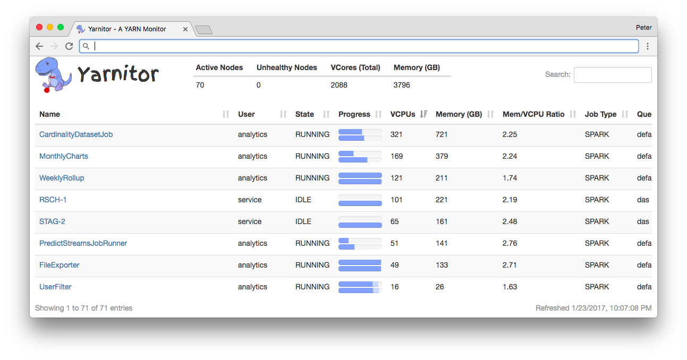

# Yarnitor

[](https://www.repostatus.org/#active)
[](https://travis-ci.org/Valassis-Digital-Media/yarnitor)

Yarnitor is a pluggable YARN monitoring API and web frontend.



## Requirements

Yarnitor relies on multiple processes, and is therefore best run using the
provided Docker configuration. You can install Docker on
[Windows](https://docs.docker.com/docker-for-windows/),
[OSX](https://docs.docker.com/docker-for-mac/), or
[Linux](https://docs.docker.com/engine/installation/linux/). You will also need
to install [docker-compose](https://docs.docker.com/compose/install/). You'll
specifically need:

* docker>=1.10
* docker-compose>=1.10

## Configure

You must set two environment variables before starting yarnitor.

1. Set `YARN_ENDPOINT` to one (or more, comma separated, if running in a HA
   configuration) YARN ResourceManager URLs.
2. Set `EXPOSED_PORT` to the port on which yarnitor serve its UI.

For example:

```bash
export YARN_ENDPOINT=http://yarn-resource-manager.mydomain.tld:8088
export EXPOSED_PORT=8080
```

## Run

To launch the yarnitor web app, background YARN polling process, and Redis in
linked Docker containers, run the following:

```bash
docker-compose up
```

## Configure Multiple Clusters

You can modify the `docker-compose.yml` to launch multiple background worker
containers that poll YARN ResourceManagers on different clusters. Configure each
container with a different `YARN_ENDPOINT` value and set `REDIS_KEY` to some
unique identifier for the cluster (e.g., `cluster-a`, `cluster-b`). When
visiting the Yarnitor web application, information about apps on `cluster-a`
will be visible under path `http://your-yarnitor-host/cluster-a` and likewise
for `cluster-b`. Set variable `DEFAULT_CLUSTER_KEY` to one of your configured
cluster identifiers to determine stats about which cluster, if any, appear when
the user visits `/` in the web application.

## Develop

To run the yarnitor web app with Flask debugging enabled, the YARN collector
process, and Redis in linked Docker containers, execute the following:

```bash
make dev
```

If you don't have make, run what make would by hand instead:

```bash
docker-compose build
docker-compose run --rm \
    -e FLASK_APP=yarnitor \
    -e FLASK_DEBUG=1 \
    -p 5000:5000 \
    web \
    flask run -h 0.0.0.0
```

## Test

To run a headless end-to-end smoke test from a mock YARN ResourceManager to the
frontend API (but not UI), execute:

```bash
make test
```

Or the long-hand equivalent:

```bash
docker-compose -f docker-compose.test.yml up -d --build
sleep 5 # to get services time to populate data
docker-compose -f docker-compose.test.yml run --rm test pytest
```

## Credits

[Nanumo Park](https://www.linkedin.com/in/nanumo-park-8b3ba713) created the
Yarnitor logo.
